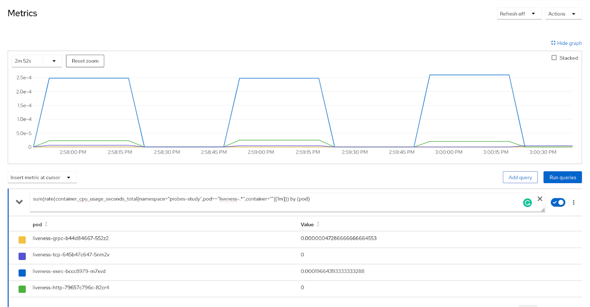

# How to design probes for Telco (low-latency) workloads in OpenShift

> By Leonardo Ochoa Aday

## Probes in Kubernetes

> <u>According to Kube’s docs:</u>
>   - A probe is a **diagnostic performed periodically by the kubelet on a container**. To perform a diagnostic, the kubelet either executes code within the container or makes a network request [[docs](https://kubernetes.io/docs/concepts/workloads/pods/pod-lifecycle/#container-probes)].

### Types of Probes

Currently, Kubernetes provides support for three [types of probes](https://kubernetes.io/docs/concepts/workloads/pods/pod-lifecycle/#types-of-probe), namely `Liveness`, `Readiness`, and `Startup`. The latter was introduced as an alpha feature gate in v1.16 and recently [promoted to GA](https://github.com/kubernetes/website/pull/23332) in v1.20.

#### livenessProbe

This probe indicates whether the container is running. If the liveness probe fails, the **kubelet kills the container**, and the container is subjected to its restart policy [[docs](https://kubernetes.io/docs/concepts/workloads/pods/pod-lifecycle/#types-of-probe)].

> <u>Note:</u>
>   - `LivenessProbes` are **only executed once StartupProbes** (if defined) **completes successfully**. On the other hand, `ReadinessProbes` and `LivenessProbes` are executed independently, and the latter can restart the container if the check mechanism fails.

##### Lifecycle

In order to design a robust recovery strategy using this probe, it is important to deeply understand its entire lifecycle first. The high-level state machine depicted below illustrates the various stages involved.

<p align="center">
   <br clear="left"/>
  <b>Figure 1:</b> State Machine of the LivenessProbe Lifecycle.
</p>

#### readinessProbe

This probe indicates whether the container is ready to respond to traffic requests. If the readiness probe fails, the **endpoints controller removes the Pod's IP address from the endpoints of all Services** that match the Pod [[docs](https://kubernetes.io/docs/concepts/workloads/pods/pod-lifecycle/#types-of-probe)].

> <u>Note:</u>
>   - `ReadinessProbes` are **also executed once StartupProbes** (if defined) **completes successfully**. Unlike `LivenessProbe`, the `ReadinessProbe` does not terminate the container, it only stops the traffic to the pod by removing its IP from the service endpoints. However, both are executed independently.

##### Lifecycle

`ReadinessProbes` also provide a strong foundation for recovery when applications fail. Below, we also provide a high-level state machine describing the lifecycle of this probe.

<p align="center">
   <br clear="left"/>
  <b>Figure 2:</b> State Machine of the ReadinessProbe Lifecycle.
</p>

#### startupProbe

This probe indicates whether the application within the container is started. If the startup probe fails, the **kubelet kills the container**, and the container is subjected to its restart policy [[docs](https://kubernetes.io/docs/concepts/workloads/pods/pod-lifecycle/#types-of-probe)].

> <u>Note:</u>
>   - When defined, the StartupProbes disable all other probes (i.e. `LivenessProbes`, and `ReadinessProbes`) until successful completion.

##### Lifecycle

In contrast to previously described probes, the `startupProbe` is specifically designed for applications that have slow (or uncertain) startup times. Below we present a high-level state machine that outlines the various stages of the `StartupProbe`'s lifecycle.

<p align="center">
   <br clear="left"/>
  <b>Figure 3:</b> State Machine of the StartupProbe Lifecycle.
</p>

### Probes API Spec

First recommendation when planning the configuration of any probe (or any other Kubernetes resource in general) is to inspect what’s available in the API spec for that object.

```shell
-> kubectl explain pod.spec.containers.{liveness,readiness,startup}Probe --recursive

KIND: 	Pod
VERSION:  v1

RESOURCE: {liveness,readiness,startup}Probe <Object>

DESCRIPTION:
 	... REDACTED ...

FIELDS:
   exec    <Object>
  	command    <[]string>
   failureThreshold    <integer>          # <- configuration field
   grpc    <Object>
  	port    <integer>
  	service    <string>
   httpGet    <Object>
  	host    <string>
  	httpHeaders    <[]Object>
     	name    <string>
     	value    <string>
  	path    <string>
  	port    <string>
  	scheme    <string>
   initialDelaySeconds    <integer>       # <- configuration field
   periodSeconds    <integer>             # <- configuration field
   successThreshold    <integer>          # <- configuration field
   tcpSocket    <Object>
  	host    <string>
  	port    <string>
   terminationGracePeriodSeconds    <integer>   # <- configuration field
   timeoutSeconds    <integer>            # <- configuration field
```

As shown above, the spec has defined four check mechanisms, namely exec, grpc, httpGet, and tcpSocket. Apart from those, there are only six fields available (denoted as "configuration field" above) to configure any Kubernetes probe [[docs](https://kubernetes.io/docs/tasks/configure-pod-container/configure-liveness-readiness-startup-probes/#configure-probes)].

- **`initialDelaySeconds`**: Number of seconds after the container has started before startup, liveness, or readiness probes are initiated. Its default and minimum value is 0.
- **`periodSeconds`**: How often (in seconds) to perform the probe. It defaults to 10 seconds, but its minimum value is 1.
- **`successThreshold`**: Minimum consecutive successes for a probe to be considered successful after having failed. Its default and minimum value is 1. Must be 1 for liveness and startup probes.
- **`timeoutSeconds`**: Number of seconds after which the probe times out. Its default and minimum value is 1.
- **`failureThreshold`**: Minimum consecutive failures for a probe to be considered failed after having succeeded. It defaults to 3, but its minimum value is 1.
- **`terminationGracePeriodSeconds` (tGPS)**: Optional field that requires its [feature gate activation](https://kubernetes.io/docs/tasks/configure-pod-container/configure-liveness-readiness-startup-probes/#probe-level-terminationgraceperiodseconds) prior to v1.27. When defined, Kubelet overrides the pod-level with the probe-level tGPS. If omitted, tGPS at pod-level will be used. It defaults to 30 seconds, but its minimum value is 1.

### Check Mechanisms

As previously commented, probes can use four different methods to diagnose the container they are monitoring, specifically `exec`, `httpGet`, `tcpSocket`, and `grpc`.

- **`exec`**: Executes a specified command inside the container. The diagnostic is considered successful if the command exits with a status code of 0.
- **`httpGet`**: Performs an HTTP GET request against the Pod's IP address. The diagnostic is considered successful if the response has a status code greater than or equal to 200 and less than 400.
- **`tcpSocket`**: Performs a TCP check against the Pod's IP address. The diagnostic is considered successful if the port is open.
- **`grpc`**: Performs a remote procedure call using gRPC. The diagnostic is considered successful if the status of the response is SERVING.

> <u>Note:</u>
>   - In terms of CPU usage, the **exec mechanism requires more CPU cycles** when running the command inside the container (see [below Section](#cpu-usage)). The exact amount of CPU usage may vary depending on the specific use case and workload.

### Probes Outcomes

Depending on the result obtained by the check mechanism, the probes have one of [three possible outcomes](https://kubernetes.io/docs/concepts/workloads/pods/pod-lifecycle/#probe-outcome), namely `Success`, `Failure`, or `Unknown`.

- **`Success`**: The container successfully passed the diagnostic.
- **`Failure`**: The container failed the diagnostic.
- **`Unknown`**: The diagnostic failed (no action should be taken, and the kubelet will make further checks).

## Design Considerations

Kubernetes documentation provides a short (but great!) explanation of when we should use [liveness](https://kubernetes.io/docs/concepts/workloads/pods/pod-lifecycle/#when-should-you-use-a-liveness-probe), [readiness](https://kubernetes.io/docs/concepts/workloads/pods/pod-lifecycle/#when-should-you-use-a-readiness-probe), and [startup](https://kubernetes.io/docs/concepts/workloads/pods/pod-lifecycle/#when-should-you-use-a-startup-probe) probes. Below, we expand on the reasoning behind those considerations, as well as further expand on new configuration samples and design patterns.

### Decide on check mechanism

As shown in the API Spec in the [above subsection](#probes-api-spec), the three types of probes may use the same check mechanisms to perform diagnostics. Therefore, this decision mainly depends on whether your **application supports the check mechanisms configured in the probe**.

Usually, front-end applications can be monitored with httpGet and tcpSocket mechanisms. For some databases, the newly available grpc mechanism can be used. Ultimately, for some back-end deployments, the exec mechanism can provide a reliable diagnostic when none of the other checks is a feasible solution.

However, if your application supports any of the available check mechanisms, then the decision might narrow down to the **check mechanism with less resource consumption** for the platform where your application is running.

#### CPU usage

In order to determine which check mechanism consumes fewer CPU resources, we have deployed a [simple demo application](https://github.com/leo8a/simple-http-grpc-server) and measured the CPU usage using Prometheus. For the measurements, we have used four `livenessProbes`, each one configured with a different [check mechanism](#check-mechanisms).

As shown in the below figure, the `livenessProbe` using the **`exec` mechanism drastically consumes more CPU cycles than the rest of the available mechanisms**. Followed by the `httpGet` mechanism which consumes way less than the `exec` process. It has been observed that this behavior greatly worsens in cluster nodes running on rt-kernel. Finally, with a negligible difference, in terms of CPU usage, are the `grpc` and `tcpSocket` mechanisms.

The Prometheus query used to measure the CPU usage of the probes can be found below.

```promQL
sum(rate(container_cpu_usage_seconds_total{namespace="probes-study",pod~="liveness-.*",container=""})) by (pod)
```

<p align="center">
   <br clear="left"/>
  <b>Figure 4:</b> CPU usage per check mechanism for a LivenessProbe.
</p>

> <u>Important Note:</u>
>   - We strongly recommend NOT TO USE probes with the `exec` mechanism in critical low-latency applications due to the high CPU usage of this type of probe. Whenever possible, try to use alternative check mechanisms (i.e. `httpGet`, `tcpSocket`, or `grpc`).

### Decide on probe configurations

This section by no means provides all the possible patterns for recovering an application using probes, since issues may vary depending on the specific use case and workload. However, we do provide the main guidelines for properly configuring probes in Kubernetes.

#### Protect against slow starting containers

Kubernetes documentation provides clear guidelines on how to configure a startupProbe properly to protect against slow starting containers [[docs](https://kubernetes.io/docs/tasks/configure-pod-container/configure-liveness-readiness-startup-probes/#define-startup-probes)].

- A slow starting container is typically a legacy application that requires additional time, which can be unpredictable, during its initialization processes.

Essentially, we need to compute the worst-case startup time and then set the `failureThreshold` and `periodSeconds` fields accordingly. Note that the `initialDelaySeconds` field should NOT BE USED for this purpose, but instead, the formula presented below.

```math
worstCaseStartupTime > failureThreshold * periodSeconds
```

## Recommendations for Telco workloads

When dealing with Telco (or low-latency) workloads in Kubernetes, it is highly recommended NOT to use probes with the `exec` mechanism configured, unless there are no other feasible alternatives such as `tcpSocket`, `grpc`, or `httpGet`.

Mind that you may also omit probes from low-priority services, where the command would need to be relatively expensive to accurately determine healthiness.

If `exec`-based diagnostics are indeed needed, it is advisable to limit the number of probes to a maximum of 10 per SNO (Single Node OpenShift) cluster and set the `periodSeconds` field to be no less than 10 seconds.

> <u>Note:</u>
>   - **It is important to periodically review your probes**. With updates, optimizations, and potential regressions in your application, your probes' performance and definition of a `healthy` state may change. Therefore, set up a reminder to regularly assess your probes. This practice will ensure that your probes accurately reflect the state of your applications and help you avoid any unexpected downtime.
